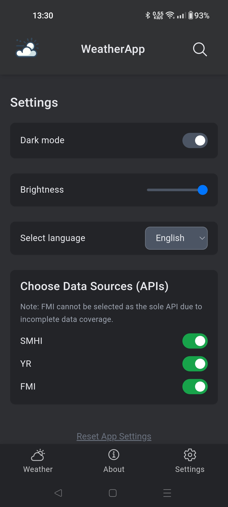

# Angular Weather App

This is an Angular-based web application that allows users to check weather information for various cities in Sweden.
This front-end application is used in conjunction with a back-end API that provides merged weather data from multiple sources.
The API is available at [https://github.com/knottem/weatherapi](https://github.com/knottem/WeatherApi).

## Table of Contents

- [Features](#features)
- [Planned Features](#planned-features)
- [Contributing](#contributing)
- [Live Demo](#live-demo)
- [Screenshots](#screenshots)
- [License](#license)

## Features

- Dark mode and brightness adjustment in settings.
- Multi-source weather data (SMHI, YR, FMI).
- Display weather information for multiple cities, including high/low temperatures, wind speed, and humidity.
- Search for cities to get weather data.
- Detailed hourly weather table.
- Error handling and feedback for users.
- Loading indicators during data fetching.
- Language support for English, Swedish, German, Spanish, and French.

## Planned Features

This is a hobby project, so while these features are planned, they may not all be implemented.

- Improve accessibility and user experience.
- Provide regional weather alerts and warnings.

## Contributing

Feel free to contribute to this project by submitting issues or pull requests. For major changes, please open an issue first to discuss what you would like to change.

## Live Demo

A live demo of this project is available at [https://weather.knotten.net](https://weather.knotten.net).

**Note**: This app is designed with a mobile-first approach. While it is fully responsive and works on desktops, the best experience is on mobile devices.

## Screenshots

Check out some screenshots of the app below from version 0.7.0:

### Weather Overview

  
  

<em>Weather overview (left) and detailed hourly weather table (right).</em>

### Search Page

  

### Settings Page

  
  

<em>The settings page in light mode (left) and dark mode (right).</em>

### Weather Overview (Desktop)

  

<em>Weather overview on a desktop screen.</em>

## License

This project is open source and available under the [MIT License](LICENSE).
